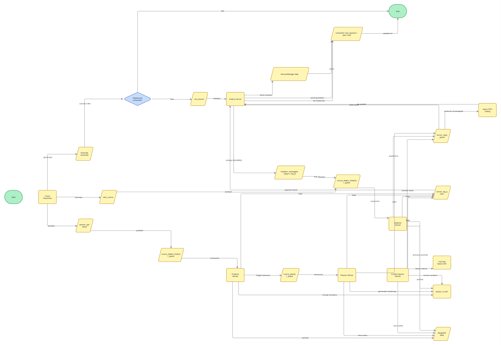

# Coursor AI: The Intelligent Learning Architect

Coursor AI is a next-generation AI-powered course generator that transforms a single prompt into a comprehensive, multi-module learning experience. It leverages a distributed microservices architecture to orchestrate multiple AI agents that plan, refine, and generate tailored educational content in real-time.

---

## Features

- **AI Blueprinting**: Instantly generates a structured roadmap including prerequisites and a main curriculum.
- **Interactive Copilot**: An intelligent interrogation phase where the AI asks clarifying questions to customize the course to your skill level and goals.
- **Real-time Generation**: Watch your course being built module-by-module with a live pipeline feed.
- **Multimedia Learning**: Rich content blocks including detailed text, structured tables, and integrated YouTube video resources.
- **Course Vault**: Save and rehydrate generated courses anytime through secure Google OAuth authentication.
- **Glassmorphic UI**: A premium, modern interface designed for focus and aesthetic appeal.

---

## Demo

https://github.com/user-attachments/assets/decfd55c-4570-4bcb-81aa-0838dbb4a743

---

## System Architecture

Coursor AI is built on a **Decoupled Microservices Architecture**, utilizing WebSockets for real-time frontend updates and RabbitMQ for asynchronous worker orchestration.

### Socket & Queue Flow

1.  **Handshake**: The client connects via **WebSockets** to the Node.js server, establishing a persistent session.
2.  **Initiation**: User prompt is sent via Socket $\rightarrow$ Server pushes to `course_details_initializer_queue`.
3.  **Interrogation**: Initializer worker identifies gaps $\rightarrow$ Sends questions back via `server_reply_queue` $\rightarrow$ Server forwards to Client.
4.  **Finalization**: User answers $\rightarrow$ Server pushes to `course_details_finalizer_queue` $\rightarrow$ Triggers `course_planner_queue`.
5.  **Planning**: Planner worker generates the full course JSON $\rightarrow$ Dispatched back to Client.
6.  **Content Injection**: The Roadmap triggers individual skill generation tasks $\rightarrow$ Content Injector worker fetches videos and generates deep-dive content $\rightarrow$ Streamed live to Client.
7.  **Logging**: All workers emit status updates to a dedicated `server_log_queue`, providing the "Pipeline Feed" in the UI.

---

## Technical Deep Dive: WebSocket Handling

Coursor AI utilizes native WebSockets (`ws` library) for low-latency, full-duplex communication between the client and the orchestrator.

### 1. Session Initialization
When a user starts a course generation, the client generates a unique `sessionId` (UUID). This ID is sent to the server via an `init_session` action. The server's `SessionManager` stores the WebSocket instance in a `Map`, keyed by this ID. This allows the server to route asynchronous RabbitMQ responses back to the correct user, even if the connection momentarily drops and reconnects.

### 2. Action-Based Protocol
Communication follows a strict JSON-based action protocol:
- **Client $\rightarrow$ Server**:
    - `init_session`: Handshake to register the socket.
    - `start_course`: Triggers the initial agent analysis.
    - `answer_questions`: Dispatches user feedback to the finalization agent.
- **Server $\rightarrow$ Client**:
    - `connected`: Confirms session registration.
    - `log`: Streams real-time agent status (e.g., "Analyzing blueprint...").
    - `question`: Renders the Copilot interrogation interface.
    - `plan`: Delivers the full structured roadmap.
    - `skill`: Streams finalized module content as it is generated.

---

## Technical Deep Dive: Queue Architecture

The backend is built on an **Asynchronous RPC (Remote Procedure Call)** pattern using RabbitMQ. This ensures the Node.js server remains non-blocking while long-running AI tasks are processed by Python workers.

### 1. Centralized Orchestration
The Node.js server acts as the central hub. It doesn't process AI logic; instead, it pushes tasks to specific queues and listens for results on a global reply queue.

### 2. The Queue Pipeline
- **`course_details_initializer_queue`**: Consumed by the Initializer Worker. It evaluates the user's prompt using the Gemini 1.5 API to determine if more info is needed.
- **`course_details_finalizer_queue`**: Consumed by the Finalizer Worker. It merges the initial prompt with user answers to create a unified context.
- **`course_planner_queue`**: Triggers the Course Planner Worker to generate the JSON roadmap (Sections, Skills, and Prerequisites).
- **`server_reply_queue`**: The "Return Path." All workers send their final results (questions, plans, or skills) here. The server uses the `messageId` header to identify which WebSocket session should receive the data.
- **`server_log_queue`**: A dedicated logging channel. Workers use this to emit "heartbeat" logs (e.g., "Searching YouTube for resources...") without interfering with the main data flow.

### 3. Message Headers & Routing
To maintain state across the distributed system, every message carries critical metadata in its headers:
- `messageId`: Always contains the `sessionId`.
- `replyTo`: Set to `server_reply_queue`, telling workers where to send the result.
- `headers['log_to']`: Set to `server_log_queue`, telling workers where to stream their logs.

### Module Breakdown

| Module | Hosting | Tech Stack | Responsibility |
| :--- | :--- | :--- | :--- |
| **Frontend** | Render | React, Vite, Lucide, CSS | Interactive UI, WebSocket client, state management. |
| **Orchestrator** | Render | Node.js, Express, `ws`, `amqplib`, Mongoose | Session management, routing, Queue/Socket bridging. |
| **AI Workers** | AWS EC2 | Python, LangChain, Pika, Gemini API | LLM orchestration, prompt engineering, content generation. |
| **Database** | MongoDB Atlas | MongoDB | Persistent storage for users and generated courses. |
| **Message Broker** | CloudAMQP | RabbitMQ | Reliable, asynchronous communication between modules. |
| **Search Engine** | External | YouTube Search API | Identifying and embedding relevant educational videos. |

---

## Tech Stack Detail

### **Frontend**
- **Framework**: React 19 (Vite)
- **Styling**: Vanilla CSS with Glassmorphic principles
- **Icons**: Lucide React
- **Auth**: @react-oauth/google

### **Backend**
- **Runtime**: Node.js
- **API Framework**: Express
- **Real-time**: Native WebSockets (`ws`)
- **Queue Client**: `amqplib`
- **ODM**: Mongoose

### **AI Engine**
- **Language**: Python 3.10+
- **LLM**: Google Gemini 1.5 Pro / Flash
- **Framework**: LangChain
- **Workers**: Distributed Python consumers using `pika`
- **Utilities**: `youtube-search-python` for resource gathering

---

## Deployment & Infrastructure

The application follows a distributed hybrid-cloud deployment model:

- **Frontend & Orchestrator**: Dockerized and deployed on **Render** for seamless scaling and managed networking.
- **AI Engine (Workers)**: Dockerized and deployed on **AWS EC2** to leverage dedicated compute resources for heavy AI orchestration.
- **Database**: **MongoDB Atlas** for managed, persistent storage.
- **Message Broker**: **CloudAMQP** (Managed RabbitMQ) serving as the bridge between Render and AWS services.

---

## 📝 License

Developed with care for the next generation of learners.
